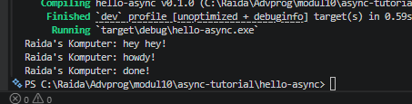
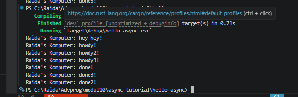

# Async Tutorial - Modul 10

## Experiment 1.1: Original timer from the book

Program berhasil dijalankan. Output menunjukkan "howdy!" diikuti jeda 2 detik,
kemudian "done!". Ini membuktikan TimerFuture bekerja secara asynchronous,
thread spawner menunggu 2 detik di background, sementara executor bisa
melakukan hal lain (jika ada task lain).


## Experiment 1.2: Understanding How It Works
### Screenshot




### Urutan Output:
```zsh
Raida's Computer: hey! hey!
Raida's Computer: howdy!
Raida's Computer: done!
```

### Penjelasan:
`"hey hey!"` muncul sebelum `"howdy!"` meskipun ditulis setelah `spawn`
Ini karena `spawn` hanya mendaftarkan task ke queue, tidak langsung menjalankannya
Task baru dieksekusi ketika `executor.run()` dipanggil
`println!("hey hey!")` adalah kode synchronous yang langsung dijalankan

## Experiment 1.3: Multiple Spawn and removing drop
### Screenshot




### Urutan Output:
```zsh
Raida's Computer: hey! hey!
Raida's Computer: howdy!
Raida's Computer: howdy2!
Raida's Computer: howdy3!
Raida's Computer: done!
Raida's Computer: done2!
Raida's Computer: done3!
```

### Penjelasan:
- `drop(spawner)` menutup channel pengiriman task
- Tanpa `drop`, executor menunggu selamanya untuk task berikutnya
- `spawner` berfungsi sebagai pintu masuk task
- `executor` adalah pekerja yang memproses task
- `drop(spawner)` adalah sinyal tidak ada task baru lagi